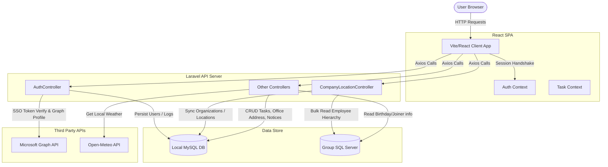

# Architecture Design

This document details the system design, components, and architectural principles of the Pricol Employee Portal (PEP-UI).

## System Design Overview
The Pricol Employee Portal is built using a decoupled Single Page Application (SPA) architecture with a React-based frontend and a Laravel-based RESTful API backend. The system connects to a local MySQL database for application-specific state (e.g., tasks, announcements, clicks logs, user roles) and integrates with Microsoft Graph API for single sign-on (SSO) and active directory operations. Additionally, it reads from a corporate Microsoft SQL Server database using a separate database connection to synchronize organization hierarchy and fetch active employee metadata.

## Component Diagram

## Core Components

### 1. React Frontend SPA (`src/`)
Built with React 19 and Vite 6, this client handles all routing, states, and user interactions. The application layout is responsive, modular, and customized. Global state managers like `AuthContext.jsx` enforce session security checks, while `TaskContext.jsx` handles tasks.

### 2. Laravel API Backend (`backend/`)
Built with Laravel 11, the backend acts as a headless REST API. It handles authentication callbacks, session management, permissions, office details CRUD, and analytics tracking. It manages connection logic between local storage and remote corporate database repositories.

### 3. Local MySQL Database (`intra_portal`)
A local transactional MySQL database storing portal-specific structures. It tracks application-specific models (such as tasks, admin-created announcements, logged click details, and office addresses). It also maps user roles (`admin`, `hr`, `superadmin`) and page access permissions.

### 4. Master MSSQL Server (`GroupCommonInfo`)
A read-only SQL Server connection used strictly for fetching corporate directories. The portal runs synchronization routines to convert employee mapping logs into normalized local MySQL hierarchical tables. It is also queried dynamically to fetch upcoming birthdays and new hires.

### 5. Microsoft Graph & External APIs
The backend connects to Microsoft Graph API to validate Azure SSO authentication, import avatar images, and fetch Outlook meetings. A public weather REST service (Open-Meteo) is queried dynamically to populate current conditions for registered office branches.

## Design Principles

1. **Database Decoupling**: Application tables are isolated from corporate directories. Local modifications (e.g., configuring office coordinates) do not write to or impact the corporate SQL Server master system.
2. **Session-Based Authentication**: Rather than stateless JWTs, standard stateful HTTP cookies with Laravel session drivers are used to simplify security handshakes and support SSO credentials sharing (e.g., cookie-based redirection to Timetrack).
3. **Chunked ETL Synchronization**: Synchronizing organizational structures is done using Laravel's database chunking. This parses thousands of corporate rows in batches of 2000, preventing server memory exhaust failures.
4. **Cache-Based Progress Tracking**: Sync logs are written to the application cache rather than DB tables, enabling the frontend to fetch real-time percentages asynchronously.
